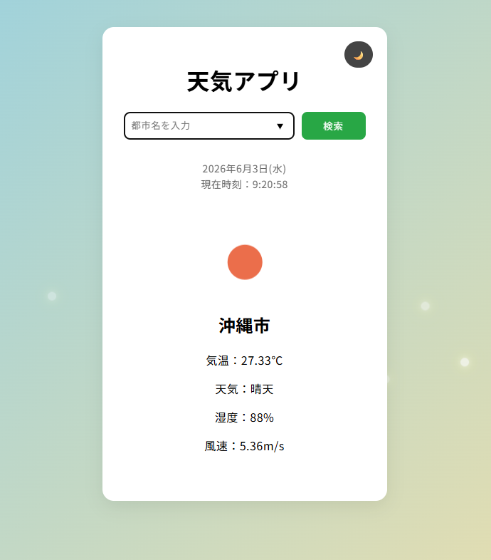
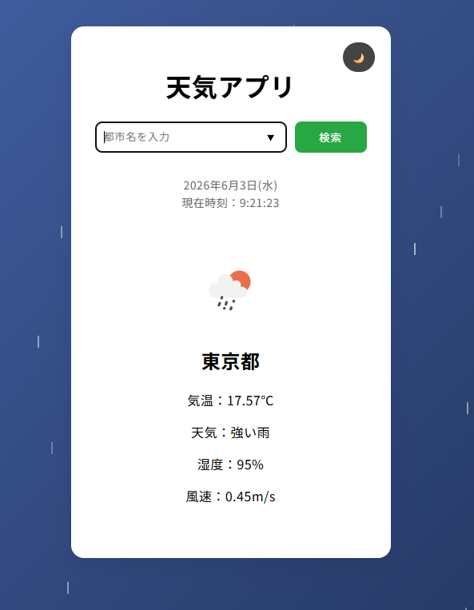
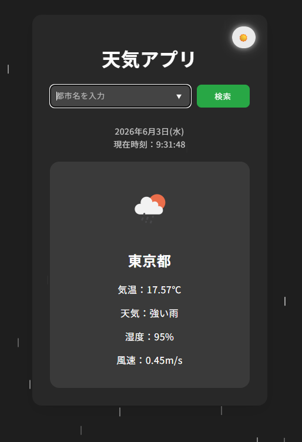

# Weather App

JavaScriptを使って天気アプリを作成しました。
都市名を入力すると、OpenWeather APIから天気情報を取得し、現在の天気を表示します。

## URL

https://saki-webdev.github.io/weather-app/

※セキュリティ対策のため、公開版ではAPIキーを除外しています。
そのため現在は天気情報を取得できません。
ローカル環境では天気情報の取得・表示まで正常に動作確認済みです。

## 参考画像

### 通常表示

### 雨天時

### ダークモード

## 機能

* OpenWeather APIを利用した天気情報の取得
* 都市名検索
* Enterキー検索
* 天気アイコン・気温・天気・湿度・風速の表示
* ローディング表示
* 検索履歴の保存（localStorage）
* ダークモードへの切り替え
* 天候ごとの背景アニメーション
（晴れ / 雨 / 曇り / 雪 / 雷雨）

## 使用技術

* HTML
* CSS
* JavaScript
* OpenWeather API
* localStorage
* GitHub Pages

## 工夫した点

* 天候ごとの背景色やアニメーションを設定し、天気を視覚的にも楽しめるようにしました。
* 検索履歴を保存し、再検索しやすくしました。
* ダークモードを実装し、利用環境に応じて見やすく切り替えられるようにしました。

## 今後追加したい機能

* 5日間天気予報の表示
* 現在地の天気の取得
* レスポンシブデザインの改善
* エラーメッセージの改善
